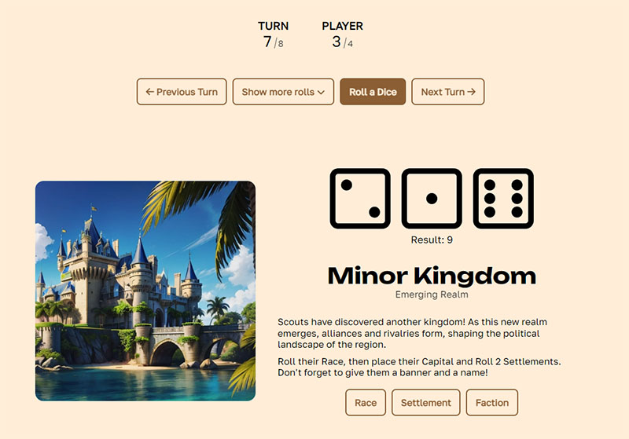

# Mappa Imperium

### Worldbuilding Game

The singleplayer web-version of a tabletop worldbuilding game [Mappa Imperium](https://nookrium.itch.io/mappa-imperium) by Nookrium.  
Try it [here](https://mappa-imperium.web.app/play).

## Main features

- Set up game duration and players amount
- Save game progress
- Roll Dices (with pictures in the results)
- Count turns
- Diety and Faction generators

## How to play

First of all, it is recommended to have a rulebook, that can be downloaded from [itch.io (Mappa Imperium)](https://nookrium.itch.io/mappa-imperium).  
Then, open [website](https://mappa-imperium.web.app/play) on a "Play" page.  
Start a new game, then set up a game duration and the players amount.  
After that, you can Roll Dices, switch turns between players, and also use all available rolls under the "Show More Rolls" button.  
Follow the instructions until the end of the game.

## Technologies Used

- HTML
- SCSS
- Vue
- JS
